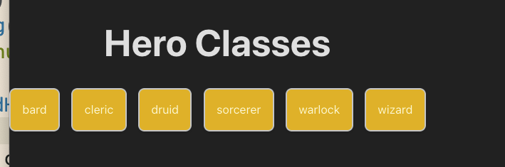

# INESDI 2025 Week 2



```tsx
export function useHeroClasses() {
  const [heroClasses, setHeroClasses] = useState<string[]>([]);
  const [loading, setLoading] = useState(true);
  const [error, setError] = useState<string | null>(null);

  useEffect(() => {
    setLoading(true);
    setError(null);

    const loadHeroClasses = async () => {
      try {
        const classes = await fetchHeroClasses();
        setHeroClasses(classes);
      } catch (error) {
        console.error("Error fetching hero classes:", error);
        setError("Failed to load hero classes");
      } finally {
        setLoading(false);
      }
    };

    loadHeroClasses();
  }, []);

  return { error, loading, heroClasses };
}

```
